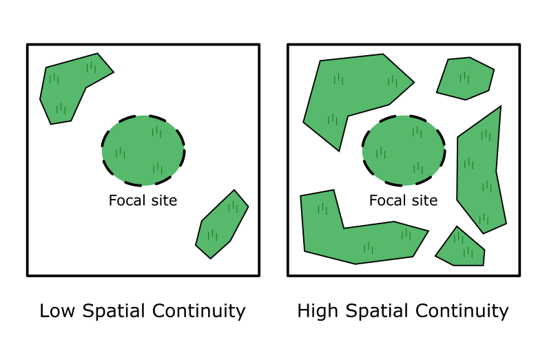
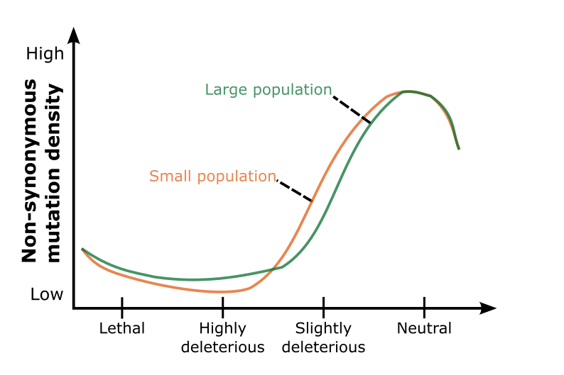
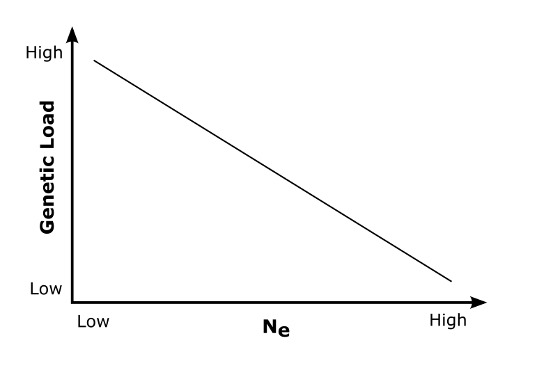

# **ECOGENETICS SETUP**

[Previous](../NOTEBOOK.md) | [Next](02_00_procedure.md)

## Quick Navigation

**[NOTEBOOK](../NOTEBOOK.md)**  
**[01 ECOGENETICS SETUP](01_00_ecogenetics_setup.md)**  
**[02 PROCEDURE](02_00_procedure.md)**  

- **[02 01 Indexing Reference Genome](02_01_indexing_reference_genome_procedure.md)**
- **[02 02 Data Preparation](02_02_data_preparation_procedure.md)**
- **[02 03 Initial Analysis Files](02_03_initial_analysis_procedure.md)**
- **[02 04 Genome Assembly](02_04_genome_assembly.md)**
- **[02 05 Genome Annotation](02_05_genome_annotation.md)**

**[03 TERMINOLOGY](03_00_terminology.md)**  
**[04 SOFTWARE](04_00_software.md)**  
**[05 CLUSTER FUNCTIONS](05_00_cluster_functions.md)**

Collection of beetles, spiders and collembolas

55 grassland/meadows -> ~20 species -> 50 individuals in pooled seq

Demographic parameters:

- Area
- Temporal continuity
- Spacial continuity

Four main research areas:

1. Basic: Diversity, structure, gene-flow
2. Environmental association studies
3. Occurence of hard vs. soft sweeps
4. Estimation of genetic load:
    - Stop-frameshift variants
    - $\pi_N/\pi_S$
    - GERP (Need to read method articles. Find out how closely related species need to be)
    - polyDFE (Distribution of Fitness Effect)

Sample sequencing:  
gDNA samples/pools  
Whole Genome Sequencing - BGI DNBSEQ PE150

## **Expectations**

The demographic parameters; area, temporal continuity and spatial continuity, will all affect $N_e$. When $N_e$ is small drift will be the major determinant of the genetic composition, when $N_e$ is large selection will be the major determinant.

[Previous](../NOTEBOOK.md) | [Next](02_00_procedure.md)