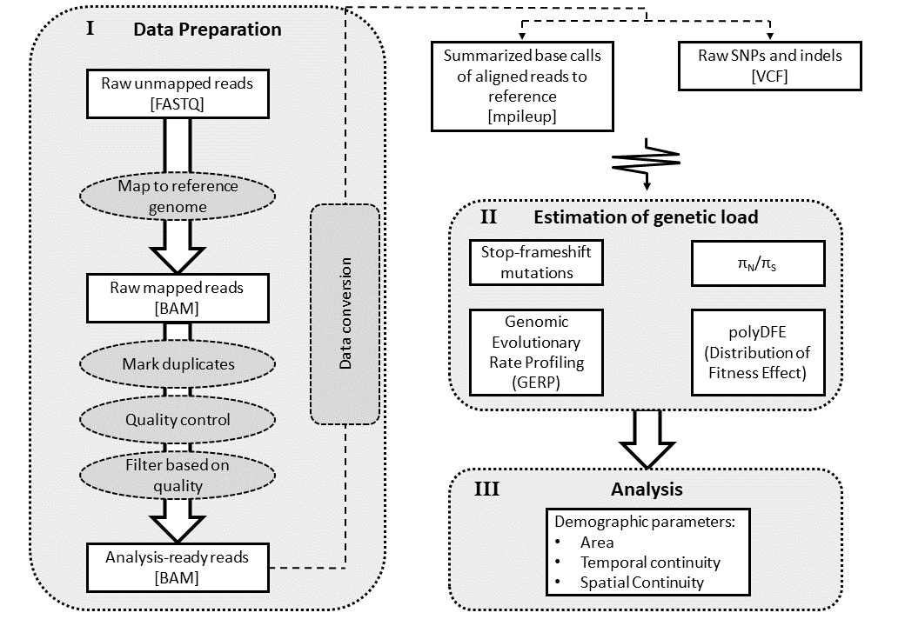

# **PROCEDURE**

[Previous](01_00_ecogenetics_setup.md) | [Next](02_01_indexing_reference_genome_procedure.md)

## Quick Navigation

**[NOTEBOOK](../NOTEBOOK.md)**  
**[01 ECOGENETICS SETUP](01_00_ecogenetics_setup.md)**  
**[02 PROCEDURE](02_00_procedure.md)**  

- **[02 01 Indexing Reference Genome](02_01_indexing_reference_genome_procedure.md)**
- **[02 02 Data Preparation](02_02_data_preparation_procedure.md)**
- **[02 03 Initial Analysis Files](02_03_initial_analysis_procedure.md)**
- **[02 04 Genome Assembly](02_04_genome_assembly.md)**
- **[02 05 Genome Annotation](02_05_genome_annotation.md)**

**[03 TERMINOLOGY](03_00_terminology.md)**  
**[04 SOFTWARE](04_00_software.md)**  
**[05 CLUSTER FUNCTIONS](05_00_cluster_functions.md)**

## Procedure Steps

[01 Indexing Reference Genome](indexing_reference_genome_procedure.md)

[02 Data Preparation](data_preparation_procedure.md)

## Overview

(Needs to be overhauled)

1. Index reference genome using "bwa index"
2. Align sample sequences to reference genome using "bwa mem"
3. Convert SAM file created by "bwa mem" to BAM file using "samtools view"
4. Sort BAM file using "samtools sort"
5. Create index file for BAM file using "samtools index"
6. Quality check
   1. Create flagstat file for BAM file using "samtools falgstat"
   2. Create idxstats file for BAM file using "samtools idxstats"
   3. Create file of alignment coverage for BAM file using "samtools coverage"
7. Filter BAM file for low quality reads
8. Check number of remaining reads after filtering

[Previous](01_00_ecogenetics_setup.md) | [Next](02_01_indexing_reference_genome_procedure.md)