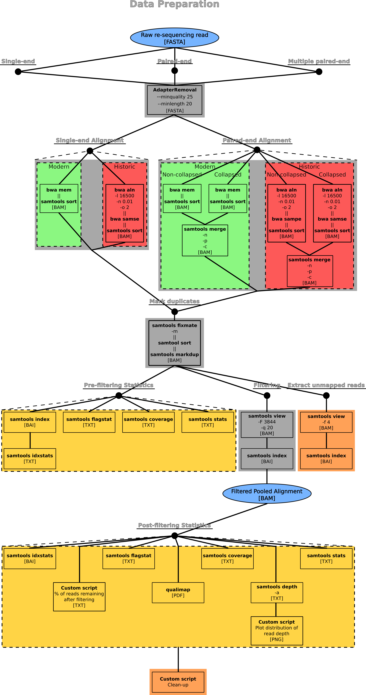

# DATA PREPARATION PROCEDURE

[Previous](02_01_indexing_reference_genome_procedure.md) | [Next](02_03_initial_analysis_procedure.md)

## Quick Navigation

**[NOTEBOOK](../NOTEBOOK.md)**  
**[01 ECOGENETICS SETUP](01_00_ecogenetics_setup.md)**  
**[02 PROCEDURE](02_00_procedure.md)**  

- **[02 01 Indexing Reference Genome](02_01_indexing_reference_genome_procedure.md)**
- **[02 02 Data Preparation](02_02_data_preparation_procedure.md)**
- **[02 03 Initial Analysis Files](02_03_initial_analysis_procedure.md)**
- **[02 04 Genome Assembly](02_04_genome_assembly.md)**
- **[02 05 Genome Annotation](02_05_genome_annotation.md)**

**[03 TERMINOLOGY](03_00_terminology.md)**  
**[04 SOFTWARE](04_00_software.md)**  
**[05 CLUSTER FUNCTIONS](05_00_cluster_functions.md)**

Needed software packages:

- AdapterRemoval
- bwa
- samtools
- qualimap

Conda environmnet used:  
[environmnet_primary_from_history.yml](../environment_primary_from_history.yml)

## Step 0: Initialization

[Initialization script](../scripts/02_data_preparation/02_data_preparation_init.sh)

## Step 1: Removal of overlapping sequences and aligningment

### Script 01 AdapterRemoval

Three different scripts for each possible case of sample sequence files:

- [02_01_paired_adapterremoval.sh](../scripts/02_data_preparation/modules/02_data_prep_01_paired_adapterremoval.sh)  
    If the sample has been paired-end sequenced.
- [02_01_pairedseveral_adapterremoval.sh](../scripts/02_data_preparation/modules/02_data_prep_01_pairedseveral_adapterremoval.sh)  
    If the sample has been paired-end sequenced in multiple sets.
- [02_01_single_adapterremoval.sh](../scripts/02_data_preparation/modules/02_data_prep_01_single_adapterremoval.sh)  
    If the sample has been single-end sequenced.

### Script 02

Two different script sets, one for paired-end and one for single-end samples:

- Paired-end
  - [02_02_paired_01_alignment.sh](../scripts/02_data_preparation/modules/02_data_prep_02_01_paired_alignment.sh)  
        Works on non-overlapping areas
  - [02_02_paired_02_alignment.sh](../scripts/02_data_preparation/modules/02_data_prep_02_02_paired_alignment.sh)  
        Works on overlapping areas
- Single-end
  - [02_02_single_alignment.sh](../scripts/02_data_preparation/modules/02_data_prep_02_single_alignment.sh)

### Script 03

Only needed for paired-end samples - Merges alignments:

[02_03_paired_merge.sh](../scripts/02_data_preparation/modules/02_data_prep_03_paired_merge.sh)

## Step 2: Mark duplicates

### Script 04

Marks duplicates, but does not remove them:

[02_04_markduplicates.sh](../scripts/02_data_preparation/modules/02_data_prep_04_markduplicates.sh)

## Step 3: Statistics pre-filtering

### Script 05

Four scripts to run several different statistics option built into samtools in parallel:

- idxstats  
    [02_05_01_prestats.sh](../scripts/02_data_preparation/modules/02_05_01_prestats.sh)
- flagstat  
    [02_05_02_prestats.sh](../scripts/02_data_preparation/modules/02_05_02_prestats.sh)
- coverage  
    [02_05_03_prestats.sh](../scripts/02_data_preparation/modules/02_05_03_prestats.sh)
- stat  
    [02_05_04_prestats.sh](../scripts/02_data_preparation/modules/02_05_04_prestats.sh)

## Step 4: Remove duplicates, unmapped reads and low quality mappings

### Script 06

Filters .bam file based on bit flags. Exclude bit flags 3844 and MAPQ < 20. 3844 covers:  

- Unmapped reads
- Not primary alignment - Alternative mappings when multiple mappings are presented
- Failed reads
- Optical or PCR duplicates
- Supplementary reads - The corresponding alignment line is part of a chimeric alignmen

ref: <https://broadinstitute.github.io/picard/explain-flags.html>

[02_06_filtering.sh](../scripts/02_data_preparation/modules/02_06_filtering.sh)

## Step 5: Statistics post-filtering

### Script 07

Four scripts to run several different statistics option built into samtools, one custom script to get percentage of reads remaining after filtering, and one script to run qualimap (general summary statistics and figures), in parallel:

- flagstat  
    [02_07_01_prestats.sh](../scripts/02_data_preparation/modules/02_07_01_prestats.sh)
- idxstats  
    [02_07_02_prestats.sh](../scripts/02_data_preparation/modules/02_07_02_prestats.sh)
- coverage  
    [02_07_03_prestats.sh](../scripts/02_data_preparation/modules/02_07_03_prestats.sh)
- stat  
    [02_07_04_prestats.sh](../scripts/02_data_preparation/modules/02_07_04_prestats.sh)
- Remaining percentage of reads  
    [02_07_05_prestats.sh](../scripts/02_data_preparation/modules/02_07_05_prestats.sh)
- Qualimap  
    [02_07_06_prestats.sh](../scripts/02_data_preparation/modules/02_07_06_prestats.sh)

Qualimap is not guaranteed to run successfully, however the cause as to why has not been determined.

## Step 6: Cleanup

### Script 8

Script to remove empty .out files and add indication of possible errors to logfile.

[02_08_cleanup.sh](../scripts/02_data_preparation/modules/02_08_cleanup.sh)

[Previous](02_01_indexing_reference_genome_procedure.md) | [Next](02_03_initial_analysis_procedure.md)
