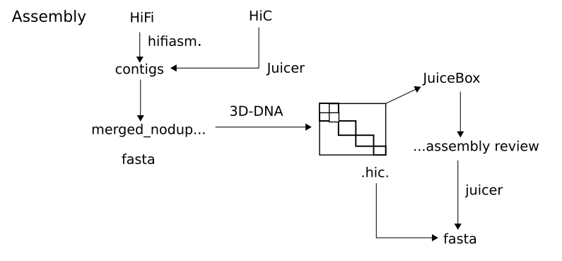

# GENOME ASSEMBLY

[Previous](02_03_initial_analysis_procedure.md) | [Next](02_05_genome_annotation.md)

## Quick Navigation

**[NOTEBOOK](../NOTEBOOK.md)**  
**[01 ECOGENETICS SETUP](01_00_ecogenetics_setup.md)**  
**[02 PROCEDURE](02_00_procedure.md)**  

- **[02 01 Indexing Reference Genome](02_01_indexing_reference_genome_procedure.md)**
- **[02 02 Data Preparation](02_02_data_preparation_procedure.md)**
- **[02 03 Initial Analysis Files](02_03_initial_analysis_procedure.md)**
- **[02 04 Genome Assembly](02_04_genome_assembly.md)**
- **[02 05 Genome Annotation](02_05_genome_annotation.md)**

**[03 TERMINOLOGY](03_00_terminology.md)**  
**[04 SOFTWARE](04_00_software.md)**  
**[05 CLUSTER FUNCTIONS](05_00_cluster_functions.md)**

## Navigation

[Navigation script](../scripts/04_assembly/04_assembly_init.sh)

## Module 1 - HiFiAdapterFilt

### Step 0: Initialization

[Initialization script](../scripts/04_assembly/hifiadapterfilt/04_hifiadapterfilt_00_init.sh)

### Step 1: Removal of PacBio HiFi Adapters

[04_hifiadapterfilt_01_hifiadapterfil.sh](../scripts/04_assembly/hifiadapterfilt/modules/04_hifiadapterfilt_01_hifiadapterfilt.sh)

## Module 2 - HiFiasm

### Step 0: Initialization

[Initialization script](../scripts/04_assembly/hifiasm/04_hifiasm_00_init.sh)

### Step 1: Assembly of Raw HiFi reads

[04_hifiasm_01_hifiasm.sh](../scripts/04_assembly/hifiasm/modules/04_hifiasm_01_hifiasm.sh)

## Module 3 - Purge_dups

### Step 0: Initialization

[Initialization script](../scripts/04_assembly/purge_dups/04_purge_dups_00_init.sh)

### Step 1:



Genome assembly, including juicer aligning Hi-C data, scaffolding 3D-DNA, and exporting the scaffolded genome fasta file after manual review.

[Assembly_worklow](../scripts/jilong/genome_assembly_workflow.py)

Tips/tricks from Jilong to keep in mind:

- Remember to "wrap" the fasta file to be scaffolded when exporting fasta, it makes the process faster. By wrap, it means the fasta file is truncated into a fixed maximum number of characters per line. 3D-DNA come together with an embedded script to do this
- For me, running 3D-DNA without mis-joint correction rounds works well. (By setting -r 0). The mis-joint corrections sometimes may even decrease the assembly quality. It is because the combination of HiFi contigs and HiC provide quite high confidence already and mis-joint correction focuses more on troubles from short reads contigs.
- It is the XXXX.0.assembly file that i used to check HiC, fix orders, and split chromosomes after scaffolding.

### 3D-DNA

3d-dna files installed to /home/jepe/miniconda3/envs/genome_assembly/share/3d-dna

executable '3d-dna' added to PATH, an alias for /home/jepe/miniconda3/envs/genome_assembly/share/3d-dna/run-asm-pipeline.sh
e.g. you can run '3d-dna contigs.fa hic.mnd'

### Hifiasm

Hifiasm produces primary/alternate assemblies or partially phased assemblies only with HiFi reads. Different types of commonly used assemblies <https://lh3.github.io/2021/04/17/concepts-in-phased-assemblies>.

Hifiasm outputs assemblies in [GFA](https://github.com/GFA-spec/GFA-spec/blob/master/GFA-spec.md) (Graphical Fragment Assembly) format

### Juicer HiC Alignment

```bash
bash /faststorage/project/EcoGenetics/people/Jeppe_Bayer/scripts/juicer/scripts/juicer.sh \
-d \ # top level directory. Working directory, needs to contain a folder name /fastq containing the fastq files. A folder will also be created here for temporary files and the final alignement
-D faststorage/project/EcoGenetics/people/Jeppe_Bayer/scripts/juicer \ # juicer scripts parent directory
-p chrom.sizes \ # path to chrom.sizes file
-s none \ # site definition
-z [fasta] \ # path to reference genome file
-q short \ # the queue for running alignments
-Q 12:00:00 \ # queue time limit
-l normal \ # the queue for running longer jobs such as hic
-L 24:00:00 \ # long queue time limit
-t 36 \ # number of threads
> [species]_juicer.log
```

[Previous](02_03_initial_analysis_procedure.md) | [Next](02_05_genome_annotation.md)
