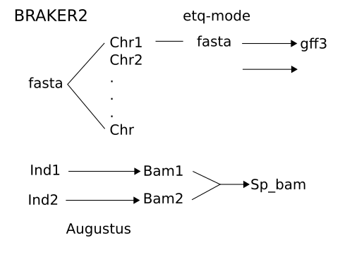
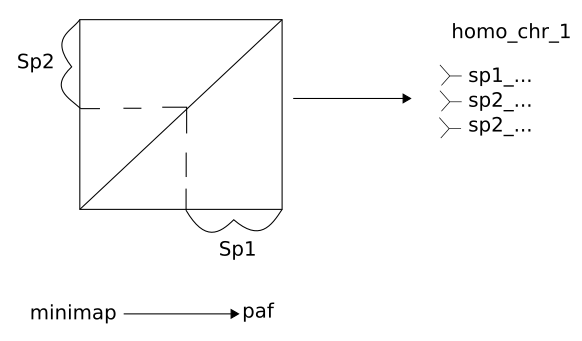

# GENOME ANNOTATION

[Previous](02_04_genome_assembly.md) | [Next](03_00_terminology.md)

## Quick Navigation

**[NOTEBOOK](../NOTEBOOK.md)**  
**[01 ECOGENETICS SETUP](01_00_ecogenetics_setup.md)**  
**[02 PROCEDURE](02_00_procedure.md)**  

- **[02 01 Indexing Reference Genome](02_01_indexing_reference_genome_procedure.md)**
- **[02 02 Data Preparation](02_02_data_preparation_procedure.md)**
- **[02 03 Initial Analysis Files](02_03_initial_analysis_procedure.md)**
- **[02 04 Genome Assembly](02_04_genome_assembly.md)**
- **[02 05 Genome Annotation](02_05_genome_annotation.md)**

**[03 TERMINOLOGY](03_00_terminology.md)**  
**[04 SOFTWARE](04_00_software.md)**  
**[05 CLUSTER FUNCTIONS](05_00_cluster_functions.md)**

BRAKER2 has conda distribution and it is way easier to install it through conda than to manually install it

[Annotation_workflow](../scripts/jilong/genome_annotation_workflow.py)

Tips/tricks from Jilong to keep in mind:

- The repbase (curated repeat sequence database) is stored in the cluster /home/jilong/spider2/faststorage/social_spiders_2020/data/public_data/repbase
- I use the repbase combined with repeatmodeler generated database to do repeatmasking. But in my case, I didn't see a huge difference in using repbase or not

### BRAKER2

The config/ directory from AUGUSTUS can be accessed with the variable AUGUSTUS_CONFIG_PATH.
BRAKER2 requires this directory to be in a writable location, so if that is not the case, copy this directory to a writable location, e.g.:
cp -r /home/jepe/miniconda3/envs/genome_annotation/config/ /absolute_path_to_user_writable_directory/
export AUGUSTUS_CONFIG_PATH=/absolute_path_to_user_writable_directory/config

Due to license and distribution restrictions, GeneMark and ProtHint should be additionally installed for BRAKER2 to fully work.
These packages can be either installed as part of the BRAKER2 environment, or the PATH variable should be configured to point to them.
The GeneMark key should be located in /home/jepe/.gm_key and GENEMARK_PATH should include the path to the GeneMark executables.

[Previous](02_04_genome_assembly.md) | [Next](03_00_terminology.md)
