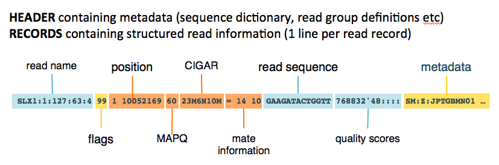

# **SOFTWARE**

[Previous](03_00_terminology.md) | [Next](05_00_cluster_functions.md)

## Quick Navigation

**[NOTEBOOK](../NOTEBOOK.md)**  
**[01 ECOGENETICS SETUP](01_00_ecogenetics_setup.md)**  
**[02 PROCEDURE](02_00_procedure.md)**  

- **[02 01 Indexing Reference Genome](02_01_indexing_reference_genome_procedure.md)**
- **[02 02 Data Preparation](02_02_data_preparation_procedure.md)**
- **[02 03 Initial Analysis Files](02_03_initial_analysis_procedure.md)**
- **[02 04 Genome Assembly](02_04_genome_assembly.md)**
- **[02 05 Genome Annotation](02_05_genome_annotation.md)**

**[03 TERMINOLOGY](03_00_terminology.md)**  
**[04 SOFTWARE](04_00_software.md)**  
**[05 CLUSTER FUNCTIONS](05_00_cluster_functions.md)**

## **BWA**

BWA is a software package for mapping low-divergent sequences against a large reference genome.  
BWA-MEM is generally recommended for high-quality queries as it is faster and more accurate.  
BWA-MEM's definiton of a secondary hit is a bit atypical. If one part of a read maps to one location and another part maps somewhere else (e.g. because of RNA splicing), the longer of the two alignments is marked as primary and the shorter one as secondary.  
Secondary alignments can be filtered from the sorted BAM with "`-F 0x100`" (choosing only hits were the secondary alignment flag is `0`)

http://bio-bwa.sourceforge.net/bwa.shtml

## **Samtools**

Reading/writing/editing/indexing/viewing SAM/BAM/CRAM format
o do anything meaningful with alignment data from BWA or other aligners (which produce text-based SAM output), one needs to convert the SAM to its binary counterpart, BAM format. The binary format is much easier for computer programs to work with. However, it is consequently very difficult for humans to read. 

**SAM/BAM format - Alignment section**  
In the SAM format, each alignment line typically represents the linear alignment of a segment. Each line consists of 11 or more TAB-separated fields. The first eleven fields are always present and in the order shown below; if the information represented by any of these fields is unavailable, that field’s value will be a placeholder, either ‘`0`’ or ‘`*`’ as determined by the field’s type. The following table gives an overview of these mandatory fields in the SAM format:



| Col | Field | Type | Regexp/Range | Brief description |
| - | - | - | - | - |
| 1 | QNAME | String | [!-?A-~]{1,254} | Query template NAME |
| 2 | FLAG | Int | [0, 2^16 − 1] | bitwise FLAG |
| 3 | RNAME | String | \* \| [:rname:^*=][:rname:]\* | Reference sequence NAME11 |
| 4 | POS | Int | [0, 2^31 − 1] | 1-based leftmost mapping POSition |
| 5 | MAPQ | Int | [0, 2^8 − 1] | MAPping Quality |
| 6 | CIGAR | String | \* \| ([0-9]+[MIDNSHPX=])+ | CIGAR string |
| 7 | RNEXT | String | \* \| =\|[:rname:^*=][:rname:]\* | Reference name of the mate/next read |
| 8 | PNEXT | Int | [0, 2^31 − 1] | Position of the mate/next read |
| 9 | TLEN | Int | [−2^31 + 1, 2^31 − 1] | observed Template LENgth |
| 10 | SEQ | String | \* \| [A-Za-z=.]+ | segment SEQuence |
| 11 | QUAL | String | [!-~]+ | ASCII of Phred-scaled base QUALity+33 |

**Bit Flags**

| Bit |  | Description |
| - | - | - |
| 1 | 0x1 | template having multiple segments in sequencing |
| 2 | 0x2 | each segment properly aligned according to the aligner |
| 4 | 0x4 | segment unmapped |
| 8 | 0x8 | next segment in the template unmapped |
| 16 | 0x10 | SEQ being reverse complemented |
|32 | 0x20 | SEQ of the next segment in the template being reverse complemented |
| 64 | 0x40 | the first segment in the template |
| 128 | 0x80 | the last segment in the template |
| 256 | 0x100 | secondary alignment |
| 512 | 0x200 | not passing filters, such as platform/vendor quality controls |
| 1024 | 0x400 | PCR or optical duplicate |
| 2048 | 0x800 | supplementary alignment |

**CIGAR string**

| Op | BAM | Description |
| - | - | - |
| M | 0 | alignment match (can be a sequence match or mismatch) |
| I | 1 | insertion to the reference |
| D | 2 | deletion from the reference |
| N | 3 | skipped region from the reference |
| S | 4 | soft clipping (clipped sequences present in SEQ) |
| H | 5 | hard clipping (clipped sequences NOT present in SEQ) |
| P | 6 | padding (silent deletion from padded reference) |
| = | 7 | sequence match |
| X | 8 | sequence mismatch |

**Command outputs:**
    
- **flagstat**  
Does full passthrough of file and calculates statistics  
Output:  
`total` (Total number of reads)  
`primary` (A read/contig is primary if is neither secondary nor supplementary)  
`secondary` (Read/contig is a secondary alignment. Typically used to flag alternative mappings when multiple mappings are presented in a SAM)  
`supplementary` (Indicates that the corresponding alignment line is part of a chimeric alignment)  
`duplicates` (PCR or optical duplicate)  
`primary duplicates` (When duplicate is also primary)  
`mapped` (Number of reads/contigs mapped to reference genome)  
`primary mapped` (Read/contig is mapped and also primary)  
`paired in sequencing` (Template having multiple segments in sequencing)  
`read1` (Reflects the read ordering within each template inerent in the sequencing technology used. For example, in Illumina paired-end sequencing, first read1 corresponds to the R1 ‘forward’ read and last read2 to the R2 ‘reverse’ read)  
`read2` (see above)  
`properly paired` (Indicating template having multiple segments in sequencing, segment is mapped and that each segment is properly aligned according to the aligner)  
`with itself and mate mapped` (Indicating template having multiple segments in sequencing, that segment is mapped and that the next segment in the template is mapped)  
`singletons` (Indicating template having multiple segments in sequencing, segment is mapped and that the next segment in the template is unmapped)  
`with mate mapped to a different chr` (Template having multiple segments in sequencing, segment is mapped, next segment in the template is mapped, and the mate refernce name (MRNM) is not the same as the reference name (RNAME))  
`with mate mapped to a different chr (mapQ>=5)` (Template having multiple segments in sequencing, segment is mapped, next segment in the template is mapped, the mate refernce name (MRNM) is not the same as the reference name (RNAME), and mapping quality (MAPQ) is greater than/rqual to 5)

- **idxstats**  
Retrives stats in the index file corresponding to the input file (BAM file need to be indexed using samtools). Output is TAB delimited, four columns. Reads may be counted multiple times if they are mapped more thab once or in multiple fragments.  
Output:  
| Reference sequence name | Sequence length | # mapped read-segments | # unmapped read-segments |
            
- **coverage**  
Computes the depth at each position or region and draws a histogram or tabulated text. Tabulated form is tab delimited with nine columns.  
Output:  
`rname` (Reference name/chromosome)  
`startpos` (Start position)  
`endpos` (End position or sequence length)  
`numreads` (Number of reads aligned to the region (after filtering))  
`covbases` (Number of covered based with depth >= 1)  
`coverage` (Percentage of covered bases [0... 100])  
`meandepth` (Mean depth of coverage)  
`meanbaseq` (Mean baseQ in covered region)  
`meanmapq` (Mean mapQ of selected reads)

- **mpileup**  
  | Chromosome Name | 1-based Position on Chromosome | Reference Base at this Position | Number of Reads Covering this Postion | Read Bases (Encodes matches, mismatches, indels, strand, MAPQ, start and end of reads) | Base Qualities (Encoded as ASCII characters; BaseQ = ASCII value - 33) |
  | --- | --- | --- | --- | --- | --- |
  |  |  |  |  |  |  |

**Commands:**

- **view**  
Views and converts SAM/BAM/CRAM files. Can be used to filter SAM/BAM/CRAM files.  
`-b` Output in BAM format
`-q` [INT] Skip alignments with MAPQ smaller than INT [0]  
`-f` [FLAG] Only output alignments with all bits set in FLAG present in the FLAG field. FLAG can be speciefied in hex by beginning with "`0x`" or as a comma separated list of flag names  
`-F` [FLAG] Do not output alignments with any bits set in FLAG present in the FLAG field. FLAG can be speciefied in hex by beginning with "`0x`" or as a comma separated list of flag names

http://www.htslib.org/

## **BCFtools**
Reading/writing BCF2/VCF/gVCF files and calling/filtering/summarising SNP and short indel sequence variants

http://www.htslib.org/

Make Diploid Variant Call File file:

```json
bcftools mpileup -Ou -d 20000 --threads 8 \
-f reference.fna \
input.bam | \
bcftools call -mv -Ob --threads 8 \
-o output.bcf
```

## **PoPoolation2**

https://sourceforge.net/p/popoolation2/wiki/Manual/

## **Pool-HMM**

https://forge-dga.jouy.inra.fr/projects/pool-hmm

## **GERP**

http://mendel.stanford.edu/sidowlab/downloads/gerp/index.html

**GERP** can seemingly be conducted at different scopes. in the related article analysis has been conducted on the mamalian scope with the platypus as the furthest species

Phylogenetic tree used for GERP++ analysis. Tree drawn to scale with respect to estimated neutral branch length. (GERP++ article)

https://journals.plos.org/ploscompbiol/article?id=10.1371/journal.pcbi.1001025#s5


## **SnpEff**

http://pcingola.github.io/SnpEff/

## **Platypus-variant**

to create .vfc from .bam  
https://www.well.ox.ac.uk/research/research-groups/lunter-group/lunter-group/platypus-a-haplotype-based-variant-caller-for-next-generation-sequence-data

## **Beagle**

phasing genotypes and imputing ungenotyped markers  
http://faculty.washington.edu/browning/beagle/beagle.html

## **PLINK**

Free, open-source whole genome association analysis toolset, designed to perform a range of basic, large-scale analyses in a computationally efficient manner.  
https://zzz.bwh.harvard.edu/plink/  
https://www.cog-genomics.org/plink/

## **BCFtools plugin**

- frameshifts
    annotates frameshift indels  
    https://samtools.github.io/bcftools/howtos/plugins.html

## **QualiMap**

A platform-independent application that provides both a graphical user interface and a command-line interface to facilitate the quality control of alignment sequencing data and its derivatives like feature counts.  
Qualimap examines sequencing alignment data in SAM/BAM files according to the features of the mapped reads and provides an overall view of the data that helps to the detect biases in the sequencing and/or mapping of the data and eases decision-making for further analysis.

[Previous](03_00_terminology.md) | [Next](05_00_cluster_functions.md)