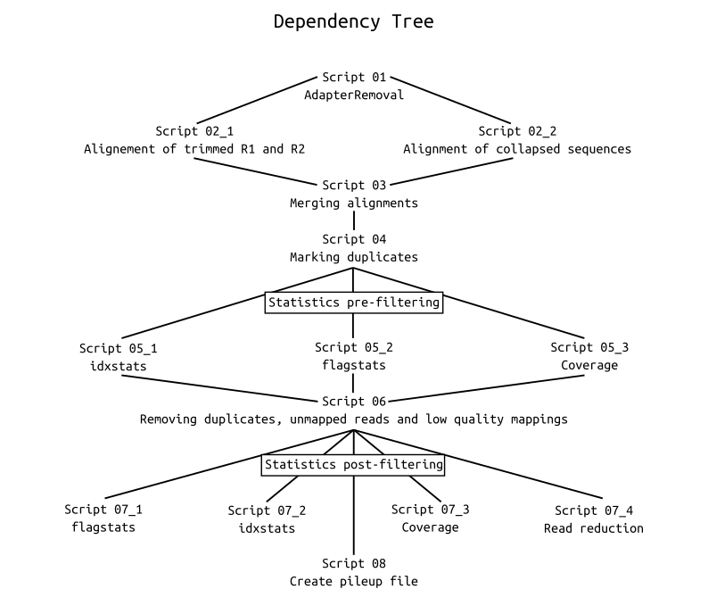

# DATA PREPARATION PROCEDURE

[Previous Procedure](indexing_reference_genome_procedure.md)

Needed software packages:

- AdapterRemoval
- bwa
- samtools
- awk

## Step 0: Initialization

(Dependency tree slightly outdated)


### Script 00

```bash
#!/bin/bash
#SBATCH --account EcoGenetics
#SBATCH --partition normal
#SBATCH --mem-per-cpu 2G
#SBATCH --cpus-per-task 1
#SBATCH --time 00:30:00

# ------------------------------------------------------------------------
# Created by Jeppe Bayer
# 
# Master's student at Aarhus University
# Department of Genetics, Ecology and Evolution
# Centre for EcoGenetics
# 
# For troubleshooting or questions:
# Email: jeppe.bayer@bio.au.dk
# ------------------------------------------------------------------------

# ----------------- Description ------------------------------------------

# Script for initializing data preparation procedure for sequence data >70MB
# Tested and working using EcoGenetics/people/Jeppe_Bayer/environment_primary_from_history.yml


# ----------------- Configuration ----------------------------------------

# Directory containing scripts, abosolute path (Do NOT end with '/')
scripts="/home/jepe/EcoGenetics/people/Jeppe_Bayer/scripts/02_data_preparation"

# Species specific reference genome, abosolute path (reference genome in FASTA format)
RG="/home/jepe/EcoGenetics/BACKUP/reference_genomes/Orchesella_cincta/GCA_001718145.1/GCA_001718145.1_ASM171814v1_genomic.fna"

# Species specific sample directory, abosolute path (Do NOT end with '/')
SD="/home/jepe/EcoGenetics/BACKUP/population_genetics/collembola/Orchesella_cincta"

# Working directory, abosolute path (Do NOT end with '/')
WD="/home/jepe/EcoGenetics/people/Jeppe_Bayer/steps"

# ----------------- Script Queue -----------------------------------------

# Creates temp directory in working directory if none exist
[[ -d $WD/temp ]] || mkdir -m 764 $WD/temp

# Creates 01_data_preparation directory in working directory if none exist
[[ -d $WD/01_data_preparation ]] || mkdir -m 764 $WD/01_data_preparation

# Creates species directory in 01_data_preparation directory if none exist
[[ -d $WD/01_data_preparation/$(basename $SD) ]] || mkdir -m 764 "$WD"/01_data_preparation/"$(basename $SD)"

# Loops through all sample folders within species specific sample directory
for sample in "$SD"/*; do

    # Checks if sample folder is empty
    if [ "$(ls -A "$sample")" ]; then

        for file in "$sample"/*.bam; do

            # Checks whether a .bam file already exists within sample folder, indicating samples have already been processed
            if [ ! -e "$file" ]; then
                
                # Creates sample directory in species directory if none exist
                [[ -d $WD/01_data_preparation/$(basename $SD)/"$(basename "$sample")" ]] || mkdir -m 764 "$WD"/01_data_preparation/"$(basename $SD)"/"$(basename "$sample")"
                
                # Creates pre- and post-filtering directory in sample directory if none exist
                [[ -d $WD/01_data_preparation/$(basename $SD)/"$(basename "$sample")"/pre_filter_stats ]] || mkdir -m 764 "$WD"/01_data_preparation/"$(basename $SD)"/"$(basename "$sample")"/pre_filter_stats
                [[ -d $WD/01_data_preparation/$(basename $SD)/"$(basename "$sample")"/post_filter_stats ]] || mkdir -m 764 "$WD"/01_data_preparation/"$(basename $SD)"/"$(basename "$sample")"/post_filter_stats
                
                # AdapterRemoval
                jid1=$(sbatch --parsable "$scripts"/02_01_data_prep.sh "$RG" "$SD" "$WD" "$sample")

                # Aligning to reference
                jid2_1=$(sbatch --parsable --dependency=afterany:"$jid1" "$scripts"/02_02_01_data_prep.sh "$RG" "$SD" "$WD" "$sample")
                jid2_2=$(sbatch --parsable --dependency=afterany:"$jid1" "$scripts"/02_02_02_data_prep.sh "$RG" "$SD" "$WD" "$sample")

                # Merging of alignment files
                jid3=$(sbatch --parsable --dependency=afterany:"$jid2_1":"$jid2_2" "$scripts"/02_03_data_prep.sh "$RG" "$SD" "$WD" "$sample")

                # Marking duplicates
                jid4=$(sbatch --parsable --dependency=afterany:"$jid3" "$scripts"/02_04_data_prep.sh "$RG" "$SD" "$WD" "$sample")

                # Statistics pre-filtering
                jid5_1=$(sbatch --parsable --dependency=afterany:"$jid4" "$scripts"/02_05_01_data_prep.sh "$RG" "$SD" "$WD" "$sample")
                jid5_2=$(sbatch --parsable --dependency=afterany:"$jid4" "$scripts"/02_05_02_data_prep.sh "$RG" "$SD" "$WD" "$sample")
                jid5_3=$(sbatch --parsable --dependency=afterany:"$jid4" "$scripts"/02_05_03_data_prep.sh "$RG" "$SD" "$WD" "$sample")
                jid5_4=$(sbatch --parsable --dependency=afterany:"$jid4" "$scripts"/02_05_04_data_prep.sh "$RG" "$SD" "$WD" "$sample")


                # Removal of duplicates, unmapped reads and low quality mappings
                jid6=$(sbatch --parsable --dependency=afterany:"$jid5_1":"$jid5_2":"$jid5_3":"$jid5_4" "$scripts"/02_06_data_prep.sh "$RG" "$SD" "$WD" "$sample")

                # Statistics post-filtering
                sbatch --dependency=afterany:"$jid6" "$scripts"/02_07_01_data_prep.sh "$RG" "$SD" "$WD" "$sample"
                sbatch --dependency=afterany:"$jid6" "$scripts"/02_07_02_data_prep.sh "$RG" "$SD" "$WD" "$sample"
                sbatch --dependency=afterany:"$jid6" "$scripts"/02_07_03_data_prep.sh "$RG" "$SD" "$WD" "$sample"
                sbatch --dependency=afterany:"$jid6" "$scripts"/02_07_04_data_prep.sh "$RG" "$SD" "$WD" "$sample"
                sbatch --dependency=afterany:"$jid6" "$scripts"/02_07_05_data_prep.sh "$RG" "$SD" "$WD" "$sample"

            else

                srun echo "$sample already contains a .bam file, $file, and is skipped"
            fi

        done

    else

        srun echo "$sample is an empty directory and is skipped"
    fi

done

exit 0
```

## Step 1: Removal of overlapping sequences

### Script 01

```bash
#!/bin/bash
#SBATCH --account EcoGenetics
#SBATCH --partition normal
#SBATCH --mem-per-cpu 6G
#SBATCH --cpus-per-task 8
#SBATCH --time 12:00:00

# Reference genome
RG=$1

# Species directory
SD=$2

# Working directory
WD=$3

# Sample directory
sample=$4

R1=

for R2 in "$sample"/*.fq.gz ; do
    if [ "$R1" ] ; then
        # 2nd entry - pair
        AdapterRemoval \
        --threads 8 \
        --file1 "$R1" \
        --file2 "$R2" \
        --adapter1 AAGTCGGAGGCCAAGCGGTCTTAGGAAGACAA \
        --adapter2 AAGTCGGATCGTAGCCATGTCGTTCTGTGAGCCAAGGAGTTG \
        --minquality 25 \
        --minlength 20 \
        --basename "$WD"/01_data_preparation/"$(basename "$SD")"/"$(basename "$sample")"/"$(basename "$sample")"_trimmed \
        --trimns \
        --trimqualities \
        --collapse

    else
        # First entry - just remember.
        R1=$R2
    fi
done

exit 0
```

### Script 02_01

```bash
#!/bin/bash
#SBATCH --account EcoGenetics
#SBATCH --partition normal
#SBATCH --mem-per-cpu 6G
#SBATCH --cpus-per-task 8
#SBATCH --time 30:00:00

# Reference genome
RG=$1

# Species directory
SD=$2

# Working directory
WD=$3

# Sample directory
sample=$4

# Align sample to reference genome
bwa mem -t 8 \
"${RG%.*}" \
"$WD"/01_data_preparation/"$(basename "$SD")"/"$(basename "$sample")"/"$(basename "$sample")"_trimmed.pair1.truncated \
"$WD"/01_data_preparation/"$(basename "$SD")"/"$(basename "$sample")"/"$(basename "$sample")"_trimmed.pair2.truncated \
| \

# Sort with regards to QNAME and convert to bam format
samtools sort -@ 7 -n -O BAM \
-T "$WD"/temp/ \
-o "$WD"/01_data_preparation/"$(basename "$SD")"/"$(basename "$sample")"/"$(basename "$sample")"_trimmed_paired_aligned.bam \
-

exit 0
```

### Script 02_02

```bash
#!/bin/bash
#SBATCH --account EcoGenetics
#SBATCH --partition normal
#SBATCH --mem-per-cpu 6G
#SBATCH --cpus-per-task 8
#SBATCH --time 30:00:00

# Reference genome
RG=$1

# Species directory
SD=$2

# Working directory
WD=$3

# Sample directory
sample=$4

# Concatenating collapsed single-end files
cat \
"$WD"/01_data_preparation/"$(basename "$SD")"/"$(basename "$sample")"/"$(basename "$sample")"_trimmed.collapsed \
"$WD"/01_data_preparation/"$(basename "$SD")"/"$(basename "$sample")"/"$(basename "$sample")"_trimmed.collapsed.truncated \
> "$WD"/01_data_preparation/"$(basename "$SD")"/"$(basename "$sample")"/"$(basename "$sample")"_trimmed_all_collapsed

# Align sample to reference genome
bwa mem -t 8 \
"${RG%.*}" \
"$WD"/01_data_preparation/"$(basename "$SD")"/"$(basename "$sample")"/"$(basename "$sample")"_trimmed_all_collapsed \
| \

# Sort with regards to QNAME and convert to bam format
samtools sort -@ 7 -n -O BAM \
-T "$WD"/temp/  \
-o "$WD"/01_data_preparation/"$(basename "$SD")"/"$(basename "$sample")"/"$(basename "$sample")"_trimmed_collapsed_aligned.bam \
-

exit 0
```

### Script 03

```bash
#!/bin/bash
#SBATCH --account EcoGenetics
#SBATCH --partition normal
#SBATCH --mem-per-cpu 6G
#SBATCH --cpus-per-task 8
#SBATCH --time 36:00:00

# Reference genome
RG=$1

# Species directory
SD=$2

# Working directory
WD=$3

# Sample directory
sample=$4

# Merge R1R2 and collapsed file to one name-sorted bam file
samtools merge -@ 7 \
-o "$WD"/01_data_preparation/"$(basename "$SD")"/"$(basename "$sample")"/"$(basename "$sample")"_trimmed_complete_aligned.bam \
-c -p -n \
"$WD"/01_data_preparation/"$(basename "$SD")"/"$(basename "$sample")"/"$(basename "$sample")"_trimmed_paired_aligned.bam \
"$WD"/01_data_preparation/"$(basename "$SD")"/"$(basename "$sample")"/"$(basename "$sample")"_trimmed_collapsed_aligned.bam

exit 0
```

## Step 2: Mark duplicates

### Script 04

```bash
#!/bin/bash
#SBATCH --account EcoGenetics
#SBATCH --partition normal
#SBATCH --mem-per-cpu 6G
#SBATCH --cpus-per-task 8
#SBATCH --time 30:00:00

# Reference genome
RG=$1

# Species directory
SD=$2

# Working directory
WD=$3

# Sample directory
sample=$4

# Add fixmate tag to alignment. Can only be done on name sorted alignment
samtools fixmate -@ 7 -m -O BAM \
"$WD"/01_data_preparation/"$(basename "$SD")"/"$(basename "$sample")"/"$(basename "$sample")"_trimmed_complete_aligned.bam \
- | \

# Position sort alignment and pipe output
samtools sort -@ 7 -O BAM \
-T "$WD"/temp/ \
- | \

# Mark duplicates and save output as .coordinatesort.bam. Also outputs some realted statistics
samtools markdup -@ 7 -s \
-f "$WD"/01_data_preparation/"$(basename "$SD")"/"$(basename "$sample")"/pre_filter_stats/"$(basename "$sample")"_markdup.markdupstats \
-T "$WD"/temp/ \
- \
"$WD"/01_data_preparation/"$(basename "$SD")"/"$(basename "$sample")"/"$(basename "$sample")"_markdup.bam

exit 0
```

## Step 3: Statistics pre-filtering

### Script 05_01

```bash
#!/bin/bash
#SBATCH --account EcoGenetics
#SBATCH --partition normal
#SBATCH --mem-per-cpu 6G
#SBATCH --cpus-per-task 8
#SBATCH --time 1:00:00

# Reference genome
RG=$1

# Species directory
SD=$2

# Working directory
WD=$3

# Sample directory
sample=$4

# Creates bai index for alignment
samtools index -@ 7 -b \
"$WD"/01_data_preparation/"$(basename "$SD")"/"$(basename "$sample")"/"$(basename "$sample")"_markdup.bam \
> "$WD"/01_data_preparation/"$(basename "$SD")"/"$(basename "$sample")"/"$(basename "$sample")"_markdup.bam.bai ; \

# Creates idxstats file for alignment
samtools idxstats -@ 7 \
"$WD"/01_data_preparation/"$(basename "$SD")"/"$(basename "$sample")"/"$(basename "$sample")"_markdup.bam \
> "$WD"/01_data_preparation/"$(basename "$SD")"/"$(basename "$sample")"/pre_filter_stats/"$(basename "$sample")"_markdup.idxstats

exit 0
```

### Script 05_02

```bash
#!/bin/bash
#SBATCH --account EcoGenetics
#SBATCH --partition normal
#SBATCH --mem-per-cpu 6G
#SBATCH --cpus-per-task 8
#SBATCH --time 1:00:00

# Reference genome
RG=$1

# Species directory
SD=$2

# Working directory
WD=$3

# Sample directory
sample=$4

# Creates flagstat file for alignment 
samtools flagstat -@ 7 \
"$WD"/01_data_preparation/"$(basename "$SD")"/"$(basename "$sample")"/"$(basename "$sample")"_markdup.bam \
> "$WD"/01_data_preparation/"$(basename "$SD")"/"$(basename "$sample")"/pre_filter_stats/"$(basename "$sample")"_markdup.flagstat

exit 0
```

### Script 05_03

```bash
#!/bin/bash
#SBATCH --account EcoGenetics
#SBATCH --partition normal
#SBATCH --mem-per-cpu 6G
#SBATCH --cpus-per-task 8
#SBATCH --time 1:00:00

# Reference genome
RG=$1

# Species directory
SD=$2

# Working directory
WD=$3

# Sample directory
sample=$4

# Creates coverage file for alignment
samtools coverage \
-o "$WD"/01_data_preparation/"$(basename "$SD")"/"$(basename "$sample")"/pre_filter_stats/"$(basename "$sample")"_markdup.coverage \
"$WD"/01_data_preparation/"$(basename "$SD")"/"$(basename "$sample")"/"$(basename "$sample")"_markdup.bam

exit 0
```

### Script 05_04

```bash
#!/bin/bash
#SBATCH --account EcoGenetics
#SBATCH --partition normal
#SBATCH --mem-per-cpu 6G
#SBATCH --cpus-per-task 8
#SBATCH --time 1:00:00

# Reference genome
RG=$1

# Species directory
SD=$2

# Working directory
WD=$3

# Sample directory
sample=$4

# Creates coverage file for alignment
samtools stats -@ 7 \
-c 1,1000,1 \
"$WD"/01_data_preparation/"$(basename "$SD")"/"$(basename "$sample")"/"$(basename "$sample")"_markdup.bam \
> "$WD"/01_data_preparation/"$(basename "$SD")"/"$(basename "$sample")"/pre_filter_stats/"$(basename "$sample")"_markdup.stats

exit 0
```

## Step 4: Remove duplicates, unmapped reads and low quality mappings

### Script 06

```bash
#!/bin/bash
#SBATCH --account EcoGenetics
#SBATCH --partition normal
#SBATCH --mem-per-cpu 6G
#SBATCH --cpus-per-task 8
#SBATCH --time 24:00:00

# Reference genome
RG=$1

# Species directory
SD=$2

# Working directory
WD=$3

# Sample directory
sample=$4

# Removes duplicates, unmapped reads, supplementary alignments, secondary alignments and  reads with a MapQ >= 20
samtools view -b -@ 7 \
-F 3844 -q 20 \
-o "$WD"/01_data_preparation/"$(basename "$SD")"/"$(basename "$sample")"/"$(basename "$sample")"_filtered.bam \
"$WD"/01_data_preparation/"$(basename "$SD")"/"$(basename "$sample")"/"$(basename "$sample")"_markdup.bam && \

# Creates bai index for filtered alignment
samtools index -@ 7 -b \
"$WD"/01_data_preparation/"$(basename "$SD")"/"$(basename "$sample")"/"$(basename "$sample")"_filtered.bam \
> "$WD"/01_data_preparation/"$(basename "$SD")"/"$(basename "$sample")"/"$(basename "$sample")"_filtered.bam.bai

exit 0
```

## Step 5: Statistics post-filtering

### Script 07_01

```bash
#!/bin/bash
#SBATCH --account EcoGenetics
#SBATCH --partition normal
#SBATCH --mem-per-cpu 6G
#SBATCH --cpus-per-task 8
#SBATCH --time 01:00:00

# Reference genome
RG=$1

# Species directory
SD=$2

# Working directory
WD=$3

# Sample directory
sample=$4

# Creates flagstat file for alignment 
samtools flagstat -@ 7 \
"$WD"/01_data_preparation/"$(basename "$SD")"/"$(basename "$sample")"/"$(basename "$sample")"_filtered.bam \
> "$WD"/01_data_preparation/"$(basename "$SD")"/"$(basename "$sample")"/post_filter_stats/"$(basename "$sample")"_filtered.flagstat

exit 0
```

### Script 07_02

```bash
#!/bin/bash
#SBATCH --account EcoGenetics
#SBATCH --partition normal
#SBATCH --mem-per-cpu 6G
#SBATCH --cpus-per-task 8
#SBATCH --time 01:00:00

# Reference genome
RG=$1

# Species directory
SD=$2

# Working directory
WD=$3

# Sample directory
sample=$4

# Creates idxstats file for alignment
samtools idxstats -@ 7 \
"$WD"/01_data_preparation/"$(basename "$SD")"/"$(basename "$sample")"/"$(basename "$sample")"_filtered.bam \
> "$WD"/01_data_preparation/"$(basename "$SD")"/"$(basename "$sample")"/post_filter_stats/"$(basename "$sample")"_filtered.idxstats

exit 0
```

### Script 07_03

```bash
#!/bin/bash
#SBATCH --account EcoGenetics
#SBATCH --partition normal
#SBATCH --mem-per-cpu 6G
#SBATCH --cpus-per-task 8
#SBATCH --time 01:00:00

# Reference genome
RG=$1

# Species directory
SD=$2

# Working directory
WD=$3

# Sample directory
sample=$4

# Creates coverage file for alignment
samtools coverage \
-o "$WD"/01_data_preparation/"$(basename "$SD")"/"$(basename "$sample")"/post_filter_stats/"$(basename "$sample")"_filtered.coverage \
"$WD"/01_data_preparation/"$(basename "$SD")"/"$(basename "$sample")"/"$(basename "$sample")"_filtered.bam

exit 0
```

### Script 07_04

```bash
#!/bin/bash
#SBATCH --account EcoGenetics
#SBATCH --partition normal
#SBATCH --mem-per-cpu 6G
#SBATCH --cpus-per-task 8
#SBATCH --time 06:00:00

# Reference genome
RG=$1

# Species directory
SD=$2

# Working directory
WD=$3

# Sample directory
sample=$4

# Creates text file listing number of reads in markdup file on first line
# number of reads in filtered file on second line and % remaining reads on the third line
samtools view -@ 7 -c \
"$WD"/01_data_preparation/"$(basename "$SD")"/"$(basename "$sample")"/"$(basename "$sample")"_filtered.bam \
> "$WD"/01_data_preparation/"$(basename "$SD")"/"$(basename "$sample")"/post_filter_stats/"$(basename "$sample")"_markdup_to_filtered.readchange && \
samtools view -@ 7 -c \
"$WD"/01_data_preparation/"$(basename "$SD")"/"$(basename "$sample")"/"$(basename "$sample")"_filtered.bam \
>> "$WD"/01_data_preparation/"$(basename "$SD")"/"$(basename "$sample")"/post_filter_stats/"$(basename "$sample")"_markdup_to_filtered.readchange && \
awk \
'BEGIN{RS = "" ; FS = "\n"}{print "\n", $2/$1*100, "%"}' \
"$WD"/01_data_preparation/"$(basename "$SD")"/"$(basename "$sample")"/post_filter_stats/"$(basename "$sample")"_markdup_to_filtered.readchange \
>> "$WD"/01_data_preparation/"$(basename "$SD")"/"$(basename "$sample")"/post_filter_stats/"$(basename "$sample")"_markdup_to_filtered.readchange

exit 0
```

### Script 07_05

```bash
#!/bin/bash
#SBATCH --account EcoGenetics
#SBATCH --partition normal
#SBATCH --mem-per-cpu 6G
#SBATCH --cpus-per-task 8
#SBATCH --time 1:00:00

# Reference genome
RG=$1

# Species directory
SD=$2

# Working directory
WD=$3

# Sample directory
sample=$4

# Creates coverage file for alignment
samtools stats -@ 7 \
"$WD"/01_data_preparation/"$(basename "$SD")"/"$(basename "$sample")"/"$(basename "$sample")"_filtered.bam \
> "$WD"/01_data_preparation/"$(basename "$SD")"/"$(basename "$sample")"/post_filter_stats/"$(basename "$sample")"_filtered.stats

exit 0
```

[Next Procedure](initial_analysis_procedure.md)
