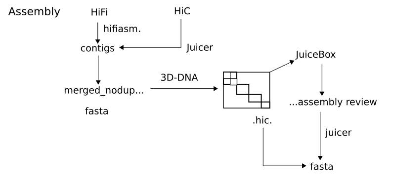
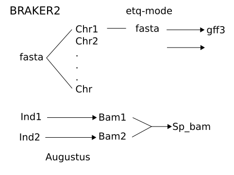
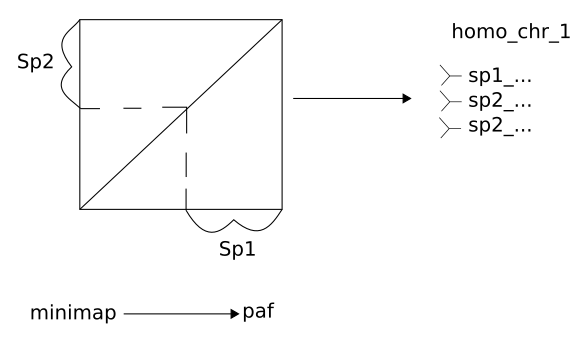

# GENOME ASSEMBLY AND ANNOTATION

## Genome Assembly

Genome assembly, including juicer aligning Hi-C data, scaffolding 3D-DNA, and exporting the scaffolded genome fasta file after manual review.

[Assembly_worklow](../scripts/jilong/genome_assembly_workflow.py)

Tips/tricks from Jilong to keep in mind:

- Remember to "wrap" the fasta file to be scaffolded when exporting fasta, it makes the process faster. By wrap, it means the fasta file is truncated into a fixed maximum number of characters per line. 3D-DNA come together with an embedded script to do this
- For me, running 3D-DNA without mis-joint correction rounds works well. (By setting -r 0). The mis-joint corrections sometimes may even decrease the assembly quality. It is because the combination of HiFi contigs and HiC provide quite high confidence already and mis-joint correction focuses more on troubles from short reads contigs.
- It is the XXXX.0.assembly file that i used to check HiC, fix orders, and split chromosomes after scaffolding.

## Genome Annotation

BRAKER2 has conda distribution and it is way easier to install it through conda than to manually install it

[Annotation_workflow](../scripts/jilong/genome_annotation_workflow.py)

Tips/tricks from Jilong to keep in mind:

- The repbase (curated repeat sequence database) is stored in the cluster /home/jilong/spider2/faststorage/social_spiders_2020/data/public_data/repbase
- I use the repbase combined with repeatmodeler generated database to do repeatmasking. But in my case, I didn't see a huge difference in using repbase or not

