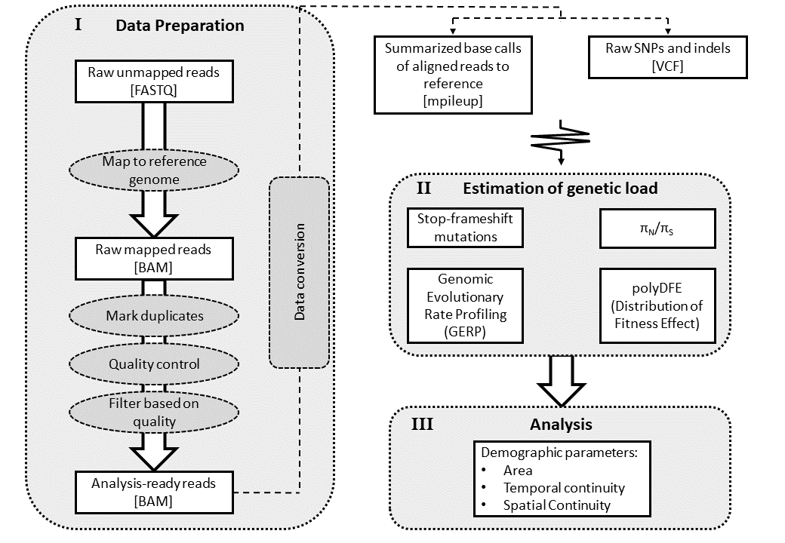
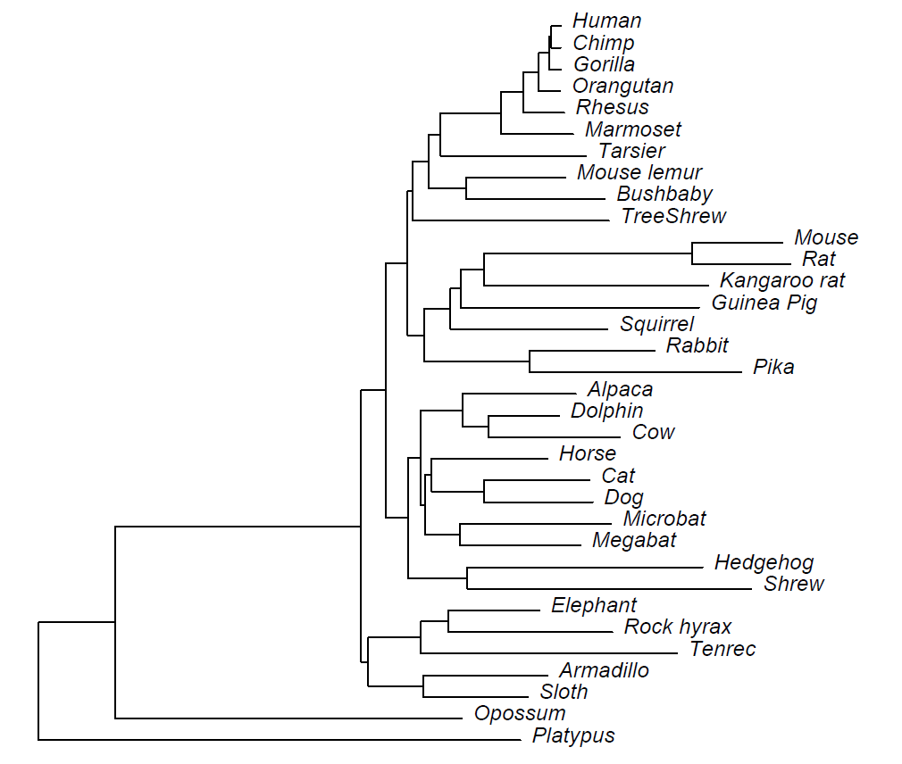

# **PROCEDURE**

## Procedure Steps

[01 Indexing Reference Genome](indexing_reference_genome_procedure.md)

[02 Data Preparation](data_preparation_procedure.md)

1. Index reference genome using "bwa index"
2. Align sample sequences to reference genome using "bwa mem"
3. Convert SAM file created by "bwa mem" to BAM file using "samtools view"
4. Sort BAM file using "samtools sort"
5. Create index file for BAM file using "samtools index"
6. Quality check
   1. Create flagstat file for BAM file using "samtools falgstat"
   2. Create idxstats file for BAM file using "samtools idxstats"
   3. Create file of alignment coverage for BAM file using "samtools coverage"
7. Filter BAM file for low quality reads
8. Check number of remaining reads after filtering

**GERP** can seemingly be conducted at different scopes. in the related article analysis has been conducted on the mamalian scope with the platypus as the furthest species

Phylogenetic tree used for GERP++ analysis. Tree drawn to scale with respect to estimated neutral branch length. (GERP++ article)

https://journals.plos.org/ploscompbiol/article?id=10.1371/journal.pcbi.1001025#s5

