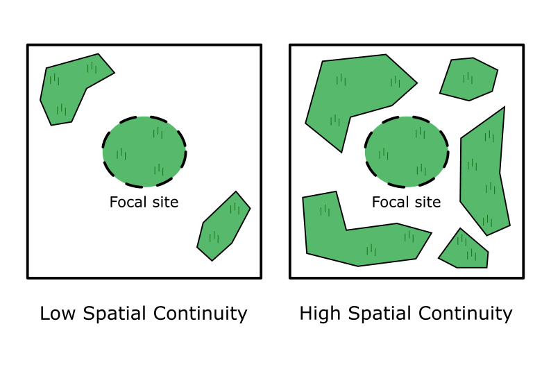
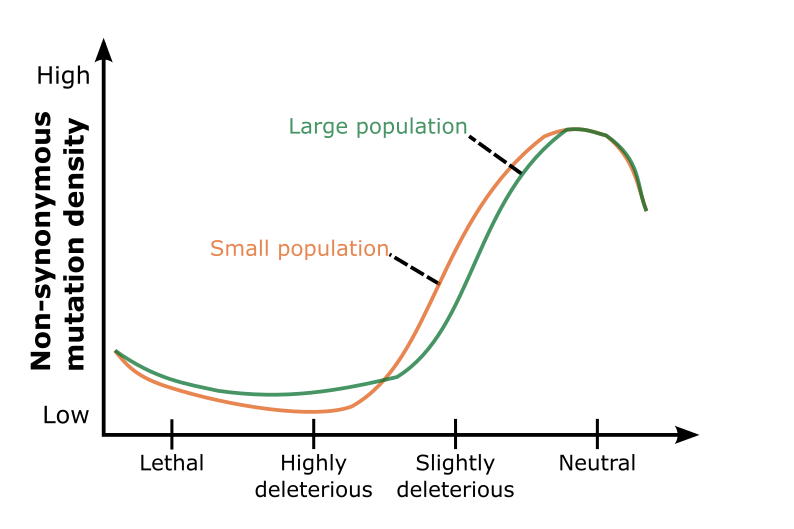
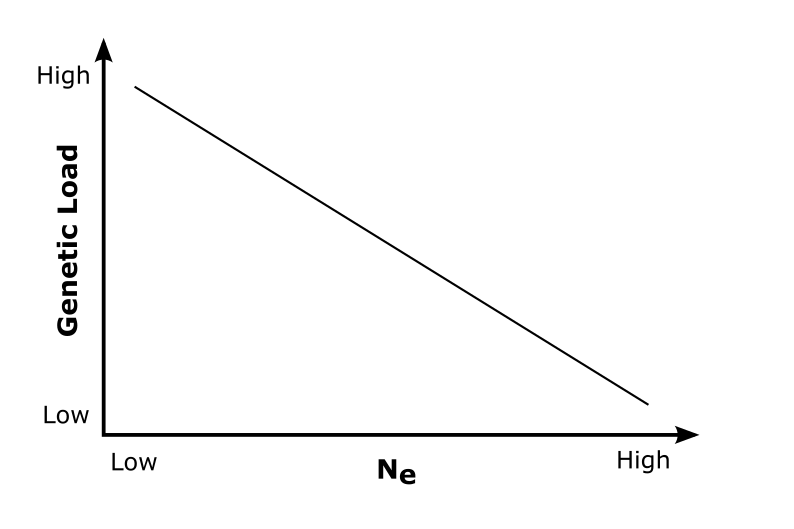

# **ECOGENETICS SETUP**

Collection of beetles, spiders and collembolas

55 grassland/meadows -> ~20 species -> 50 individuals in pooled seq

Demographic parameters:

- Area
- Temporal continuity
- Spacial continuity

Four main research areas:

1. Basic: Diversity, structure, gene-flow
2. Environmental association studies
3. Occurence of hard vs. soft sweeps
4. Estimation of genetic load:
    - Stop-frameshift variants
    - $\pi_N/\pi_S$
    - GERP (Need to read method articles. Find out how closely related species need to be)
    - polyDFE (Distribution of Fitness Effect)

Sample sequencing:  
gDNA samples/pools  
Whole Genome Sequencing - BGI DNBSEQ PE150

## **Expectations**

The demographic parameters; area, temporal continuity and spatial continuity, will all affect $N_e$. When $N_e$ is small drift will be the major determinant of the genetic composition, when $N_e$ is large selection will be the major determinant.
